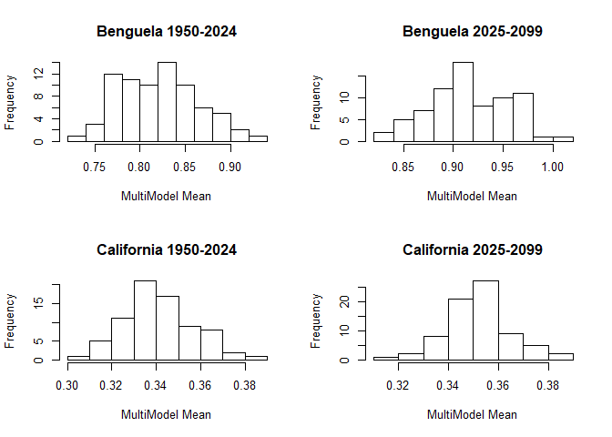
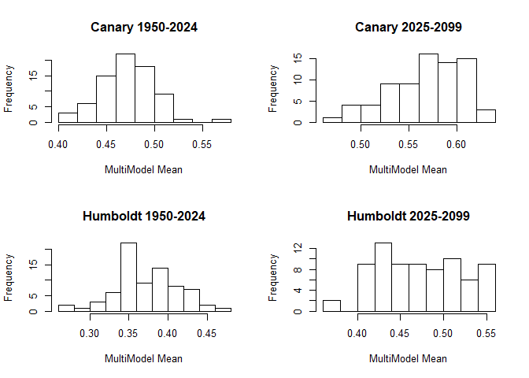
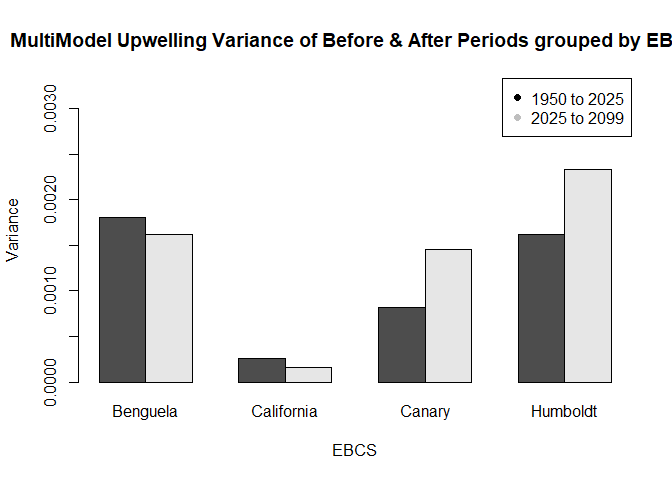
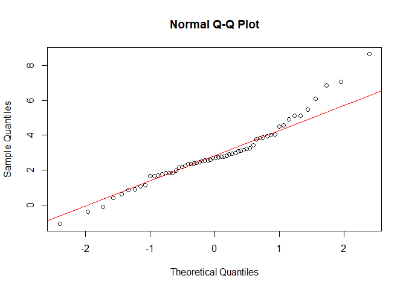
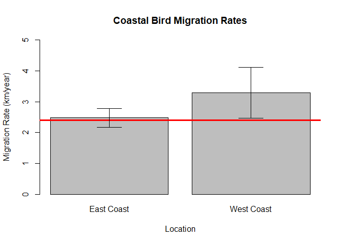

# Assignment 2
Madeleine Tomasic, Julian Stanley, Patrick Garrity, Emily Navarrete  

Instructions
------------

Please follow the instructions below to complete your assignment:

1. Open the R markdown template **biostatistics-assignmentTemplate.Rmd** in RStudio
2. Insert the relevant information (i.e., assignment number, names of all students in the group)
3. Save the file as **assnNUMBER-yourLastNames.Rmd** replacing **NUMBER** with the assignment \# and replacing **yourLastNames** with the last names of all individuals in the Group. For example **assn1-SmithJohnson.Rmd**
4. Your answers should consist of the R code used to generate the results and their interpretation
5. Do not use any special symbols such as \%, \#, \$, and \& in your answers
6. Generate an HTML version of the Markdown document by clicking on the **Knit** icon in RStudio
7. ONE PERSON in the group: Email an HTML and Markdown version of your completed assignment to your TA
8. ONE PERSON in the group: Upload the Markdown version of your completed assignment to Turnitin on Blackboard. (Failure to complete this will result in a 10% deduction off your grade.)

### Statement of Author contributions
We were each assigned four problems each. After we solved the problems individually (and inevitably messed up in different ways), we went through
each problem together and talked about the questions and corrected mistakes.

Madeleine - Problem 1.4-1.6

Patrick - Problem 1.1-1.3

Emily - Problem 2

Julian - Problem 3

Problem 1
---------

```r
# Read all of the data
benguela<- read.csv("http://faraway.neu.edu/data/assn3_benguela.csv")
cali<-read.csv("http://faraway.neu.edu/data/assn3_california.csv")
Canary<-read.csv("http://faraway.neu.edu/data/assn3_canary.csv")
humboldt<-read.csv("http://faraway.neu.edu/data/assn3_humboldt.csv")
```


### Part 1

```r
#  Make a new period column, set that equal to either Before or After
benguela$period<-ifelse(benguela$year>=1950 & benguela$year <=2024,"Before","After")

cali$period<-ifelse(cali$year>=1950 & cali$year <=2024,"Before","After")

Canary$period<-ifelse(Canary$year>=1950 & Canary$year <=2024,"Before","After")

humboldt$period<-ifelse(humboldt$year>=1950 & humboldt$year <=2024,"Before","After")
```

### Part 2

```r
# Create a new dataframe for each area that includes multimodel mean
# Look at the head each dataframe afterwards to make sure it came out right
bermean<-data.frame(benguela$year,benguela$period,rowMeans(benguela[1:150,1:22]))
colnames(bermean)<-c("Year","Period","MultiModel")
head(bermean)
```

```
##   Year Period MultiModel
## 1 1950 Before  0.7887173
## 2 1951 Before  0.8022314
## 3 1952 Before  0.7869314
## 4 1953 Before  0.8226568
## 5 1954 Before  0.8397959
## 6 1955 Before  0.7614782
```


```r
Calimean<-data.frame(cali$year,cali$period,rowMeans(cali[1:150,1:22]))
colnames(Calimean)<-c("Year","Period","MultiModel")
head(Calimean)
```

```
##   Year Period MultiModel
## 1 1950 Before  0.3417591
## 2 1951 Before  0.3191518
## 3 1952 Before  0.3469232
## 4 1953 Before  0.3398432
## 5 1954 Before  0.3459844
## 6 1955 Before  0.3287795
```


```r
Canmean<-data.frame(Canary$year,Canary$period,rowMeans(Canary[1:150,1:22]))
colnames(Canmean)<-c("Year","Period","MultiModel")
head(Canmean)
```

```
##   Year Period MultiModel
## 1 1950 Before  0.4734609
## 2 1951 Before  0.4957750
## 3 1952 Before  0.4772050
## 4 1953 Before  0.4699382
## 5 1954 Before  0.4834586
## 6 1955 Before  0.4718141
```


```r
Hummean<-data.frame(humboldt$year,humboldt$period,rowMeans(humboldt[1:150,1:22]))
colnames(Hummean)<-c("Year","Period","MultiModel")
head(Hummean)
```

```
##   Year Period MultiModel
## 1 1950 Before  0.3325485
## 2 1951 Before  0.3584342
## 3 1952 Before  0.3464716
## 4 1953 Before  0.3398514
## 5 1954 Before  0.3408307
## 6 1955 Before  0.3033469
```

### Part 3

```r
# Subset each dataframe into a "before" and "after" set
BenBefore<-subset(bermean,subset=Period=="Before") 
BenAfter<-subset(bermean,subset=Period=="After") 
CaliBefore<-subset(Calimean,subset=Period=="Before") 
CaliAfter<-subset(Calimean,subset=Period=="After") 
CanBefore<-subset(Canmean,subset=Period=="Before") 
CanAfter<-subset(Canmean,subset=Period=="After") 
HumBefore<-subset(Hummean,subset=Period=="Before") 
HumAfter<-subset(Hummean,subset=Period=="After") 
```


```r
# Plot the before-and-after histograms (8 total) in two, 2X2 plots
par(mfrow=c(2,2))
hist(BenBefore$Multi, main = "Benguela 1950-2024", xlab = "MultiModel Mean")
hist(BenAfter$Multi, main = "Benguela 2025-2099", xlab = "MultiModel Mean")
hist(CaliBefore$Multi, main = "California 1950-2024", xlab = "MultiModel Mean")
hist(CaliAfter$Multi, main = "California 2025-2099", xlab = "MultiModel Mean")
```

<!-- -->

```r
par(mfrow=c(2,2))
hist(CanBefore$Multi, main = "Canary 1950-2024", xlab = "MultiModel Mean")
hist(CanAfter$Multi, main = "Canary 2025-2099", xlab = "MultiModel Mean")
hist(HumBefore$Multi, main = "Humboldt 1950-2024", xlab = "MultiModel Mean")
hist(HumAfter$Multi, main = "Humboldt 2025-2099", xlab = "MultiModel Mean")
```

<!-- -->


```r
#The p value is greater than 0.05 and thus we fail to reject the null hypothesis since the data comes from a normal distribution
paste("Benguela p-value before:", shapiro.test(BenBefore$Multi)$p.value)
```

```
## [1] "Benguela p-value before: 0.402816582856205"
```

```r
#The p value is greater than 0.05 and thus we fail to reject the null hypothesis since the data comes from a normal distribution
paste("Benguela p-value after:", shapiro.test(BenAfter$Multi)$p.value)
```

```
## [1] "Benguela p-value after: 0.820412608262402"
```

```r
#The p value is greater than 0.05 and thus we fail to reject the null hypothesis since the data comes from a normal distribution
paste("California p-value before:", shapiro.test(CaliBefore$Multi)$p.value)
```

```
## [1] "California p-value before: 0.792949114417948"
```

```r
#The p value is greater than 0.05 and thus we fail to reject the null hypothesis since the data comes from a normal distribution
paste("California p-value after:", shapiro.test(CaliAfter$Multi)$p.value)
```

```
## [1] "California p-value after: 0.173748638422888"
```

```r
#The p value is greater than 0.05 and thus we fail to reject the null hypothesis since the data comes from a normal distribution
paste("Canary p-value before:", shapiro.test(CanBefore$Multi)$p.value)
```

```
## [1] "Canary p-value before: 0.581717347137344"
```

```r
#The p value is less than 0.05 and thus we reject the null hypothesis since the data  does not come from a normal distribution
paste("Canary p-value after:", shapiro.test(CanAfter$Multi)$p.value)
```

```
## [1] "Canary p-value after: 0.0249587345560979"
```

```r
#The p value is greater than 0.05 and thus we fail to reject the null hypothesis since the data comes from a normal distribution
paste("Humboldt p-value before", shapiro.test(HumBefore$Multi)$p.value)
```

```
## [1] "Humboldt p-value before 0.685827913735156"
```

```r
#The p value is less than 0.05 and thus we reject the null hypothesis since the data  does not come from a normal distribution
paste("Humboldt p-value after", shapiro.test(HumAfter$Multi)$p.value)
```

```
## [1] "Humboldt p-value after 0.0248879476266704"
```

The p-value of Canary after and Humboldt after are lower than an alpha of 0.05, therefore we must only use non-parametric tests.

When using non-parametric it is harder to reject the null hypothesis due to the decrease in its power compared to parametric test.


### Part 4

Null: The multimodel means for the "before" and "after" periods are the same for each EBCS.

Alternative: The multimodel means for the "before" and "after" periods are not the same for each EBCS. 


```r
wilcox.test(MultiModel ~ Period, data=bermean)
```

```
## 
## 	Wilcoxon rank sum test with continuity correction
## 
## data:  MultiModel by Period
## W = 5319, p-value < 2.2e-16
## alternative hypothesis: true location shift is not equal to 0
```

```r
#Means are not the same for Benguela EBCS before and after periods (reject null). 
# p value < 2.2e-16 < .05
```


```r
wilcox.test(MultiModel ~ Period, data = Calimean)
```

```
## 
## 	Wilcoxon rank sum test with continuity correction
## 
## data:  MultiModel by Period
## W = 3894, p-value = 4.841e-05
## alternative hypothesis: true location shift is not equal to 0
```

```r
#Means are not the same for California EBCS before and after periods (reject null).
# p value = 4.841e-05 < .05
```


```r
wilcox.test(MultiModel ~ Period, data = Canmean)
```

```
## 
## 	Wilcoxon rank sum test with continuity correction
## 
## data:  MultiModel by Period
## W = 5463, p-value < 2.2e-16
## alternative hypothesis: true location shift is not equal to 0
```

```r
#Means are not the same for Canary EBCS before and after periods (reject null).
# p value < 2.2e-16 < .05
```

```r
wilcox.test(MultiModel ~ Period, data = Hummean)
```

```
## 
## 	Wilcoxon rank sum test with continuity correction
## 
## data:  MultiModel by Period
## W = 5349, p-value < 2.2e-16
## alternative hypothesis: true location shift is not equal to 0
```

```r
#Means are not the same for Humboldt EBCS before and after periods (reject null.)
# p value < 2.2e-16 < .05
```


### Part 5


```r
BenBefMean<-mean(BenBefore$MultiModel)
BenAftMean<-mean(BenAfter$MultiModel)
CaliBefMean<-mean(CaliBefore$MultiModel)
CaliAftMean<-mean(CaliAfter$MultiModel)
CanBefMean<-mean(CanBefore$MultiModel)
CanAftMean<-mean(CanAfter$MultiModel)
HumBefMean<-mean(HumBefore$MultiModel)
HumAftMean<-mean(HumAfter$MultiModel)
BefAftMeans<-c(BenBefMean, BenAftMean, CaliBefMean, CaliAftMean, CanBefMean, CanAftMean, HumBefMean, HumAftMean)
BefAftMeans
```

```
## [1] 0.8206088 0.9159404 0.3415715 0.3515175 0.4721527 0.5670722 0.3717131
## [8] 0.4732848
```

```r
MeansBP<-matrix(BefAftMeans, nrow = 2, ncol = 4, byrow = FALSE)
```


```r
se <- function(x) sqrt(var(x)/length(x))

BenBefSE<-1.96*se(BenBefore$MultiModel)
upperBBSE<-BenBefMean+BenBefSE
lowerBBSE<-BenBefMean-BenBefSE

BenAftSE<-1.96*se(BenAfter$MultiModel)
upperBASE<-BenAftMean+BenAftSE
lowerBASE<-BenAftMean-BenAftSE

CaliBefSE<-1.96*se(CaliBefore$MultiModel)
upperCBSE<-CaliBefMean+CaliBefSE
lowerCBSE<-CaliBefMean-CaliBefSE

CaliAftSE<-1.96*se(CaliAfter$MultiModel)
upperCASE<-CaliAftMean+CaliAftSE
lowerCASE<-CaliAftMean-CaliAftSE

CanBefSE<-1.96*se(CanBefore$MultiModel)
upperCanBSE<-CanBefMean+CanBefSE
lowerCanBSE<-CanBefMean-CanBefSE

CanAftSE<-1.96*se(CanAfter$MultiModel)
upperCanASE<-CanAftMean+CanAftSE
lowerCanASE<-CanAftMean-CanAftSE

HumBefSE<-1.96*se(HumBefore$MultiModel)
upperHBSE<-HumBefMean+HumBefSE
lowerHBSE<-HumBefMean-HumBefSE

HumAftSE<-1.96*se(HumAfter$MultiModel)
upperHASE<-HumAftMean+HumAftSE
lowerHASE<-HumAftMean-HumAftSE

bp<- barplot(MeansBP, names.arg = c('Benguela', 'California', 'Canary', 'Humboldt'), beside = TRUE, ylim = c(0,1), legend=c('Before','After'), main = 'Multimodel Means Before & After 2025 for Coastal Upwelling Currents', ylab = "mean (m^2/s)", xlab = "EBCS", cex.main = .9)

arrows(x0 = bp, x1 = bp, y0 = c(upperBBSE, upperBASE, upperCBSE, upperCASE, upperCanBSE, upperCanASE, upperHBSE, upperHASE), y1 = c(lowerBBSE, lowerBASE, lowerCBSE, lowerCASE, lowerCanBSE, lowerCanASE, lowerHBSE, lowerHASE), angle = 90, code = 3)
```

<!-- -->


### Part 6

Multimodel mean upwelling appears to increase between "before" and "after" periods for all EBCS's. 


Problem 2
---------

### Part 1

```r
#F test and Levene's test both assess if variance between 2 groups differ. Assumptions of the F test are that the data in each sample are randomly sampled/independent and that the data is normally distributed. Assumptions of Levene's test is that the data in each sample are randomly sampled/independent. The Levene test does not require a normal distribution.
```

### Part 2

```r
#Null Hypothesis: Group variance does not vary between the before and after periods in each EBCS
#Alternative hypothesis: Group variance does vary between the before and after periods in each EBCS
```


```r
#Load the R package in order to run levene's test
library(car)
```

```
## Warning: package 'car' was built under R version 3.4.3
```

```r
# Test for normality across both time periods
shapiro.test(bermean$`MultiModel`)
```

```
## 
## 	Shapiro-Wilk normality test
## 
## data:  bermean$MultiModel
## W = 0.98166, p-value = 0.04288
```

```r
shapiro.test(Calimean$`MultiModel`)
```

```
## 
## 	Shapiro-Wilk normality test
## 
## data:  Calimean$MultiModel
## W = 0.99364, p-value = 0.7527
```

```r
shapiro.test(Canmean$`MultiModel`)
```

```
## 
## 	Shapiro-Wilk normality test
## 
## data:  Canmean$MultiModel
## W = 0.9555, p-value = 9.646e-05
```

```r
shapiro.test(Hummean$`MultiModel`)
```

```
## 
## 	Shapiro-Wilk normality test
## 
## data:  Hummean$MultiModel
## W = 0.97777, p-value = 0.01559
```

```r
#Note: Given that not all of the EBCS Multimodel means were normally distributed, the Levene test was chosen for all EBCS
leveneTest(bermean$`MultiModel` ~ bermean$Period)
```

```
## Levene's Test for Homogeneity of Variance (center = median)
##        Df F value Pr(>F)
## group   1  0.5294  0.468
##       148
```

```r
leveneTest(Calimean$`MultiModel` ~ Calimean$Period)
```

```
## Levene's Test for Homogeneity of Variance (center = median)
##        Df F value  Pr(>F)  
## group   1  5.7206 0.01802 *
##       148                  
## ---
## Signif. codes:  0 '***' 0.001 '**' 0.01 '*' 0.05 '.' 0.1 ' ' 1
```

```r
leveneTest(Canmean$`MultiModel` ~ Canmean$Period)
```

```
## Levene's Test for Homogeneity of Variance (center = median)
##        Df F value  Pr(>F)  
## group   1  6.6044 0.01116 *
##       148                  
## ---
## Signif. codes:  0 '***' 0.001 '**' 0.01 '*' 0.05 '.' 0.1 ' ' 1
```

```r
leveneTest(Hummean$`MultiModel` ~ Hummean$Period)
```

```
## Levene's Test for Homogeneity of Variance (center = median)
##        Df F value  Pr(>F)  
## group   1  5.3757 0.02179 *
##       148                  
## ---
## Signif. codes:  0 '***' 0.001 '**' 0.01 '*' 0.05 '.' 0.1 ' ' 1
```
P for Benguela is 0.468 which is greater than alpha = 0.05. We fail to reject the null hypothesis. Group variance for Benguela **does not vary** significantly between the before and after periods

P for California is 0.018 which is less than alpha = 0.05. We reject the null hypothesis. Group variance for California **does vary** significantly between the before and after periods

P for Canary is 0.01116 which is less than alpha = 0.05. We reject the null hypothesis. Group variance in Canary **does vary** significantly between the before and after periods

P for Humboldt is 0.022 which is less than alpha = 0.05. We reject the null hypothesis. Group variance in Humboldt **does vary** significantly between the before and after periods

### Part 3

```r
# Create a temporary variable for the variance of each EBCS period
a <- var(BenBefore$`MultiModel`)
b <- var(BenAfter$`MultiModel`)
c <- var(CaliBefore$`MultiModel`)
d <- var(CaliAfter$`MultiModel`)
e <- var(CanBefore$`MultiModel`)
f <- var(CanAfter$`MultiModel`)
g <- var(HumBefore$`MultiModel`)
h <- var(HumAfter$`MultiModel`)

# Create a matrix of the variance of each location
mat <- cbind(c(a,b), c(c,d), c(e,f), c(g,h))

# Gives names to the rows and columns in the matrix
rownames(mat) <- c("1950 to 2025", "2025 to 2099")
colnames(mat) <- c("Benguela", "California", "Canary", "Humboldt")

# Take a peek at the matrix
mat
```

```
##                 Benguela   California      Canary    Humboldt
## 1950 to 2025 0.001811230 0.0002568790 0.000823164 0.001622695
## 2025 to 2099 0.001624051 0.0001638703 0.001454546 0.002330059
```

```r
# Make a barplot
bp <- barplot(mat, beside = T, ylim = c(0, max(mat)+0.001), ylab = "Variance", xlab = "EBCS")

# Give that barplot a legend. Barplots love legends
legend("topright", legend = rownames(mat), col = c("black", "gray"), pch = c(19,19))

# And a title too
title(main = "MultiModel Upwelling Variance of Before & After Periods grouped by EBCS")
```

<!-- -->


### Part 4

The variance of Benguela did not change between 1950-2024 and 2025-2099.

The variance of California decreased between 1950-2024 and 2025-2099.

The variance of Canary increased between 1950-2024 and 2025-2099.

The variance of Humboldt increased between 1950-2024 and 2025-2099.

These changes are somewhat robust with respect to the change in means. 


```r
# for reference, make a table of the mean changes
# Create a temporary variable for the variance of each location
a <- mean(BenBefore$`MultiModel`)
b <- mean(BenAfter$`MultiModel`)
c <- mean(CaliBefore$`MultiModel`)
d <- mean(CaliAfter$`MultiModel`)
e <- mean(CanBefore$`MultiModel`)
f <- mean(CanAfter$`MultiModel`)
g <- mean(HumBefore$`MultiModel`)
h <- mean(HumAfter$`MultiModel`)

# Create a matrix of the variance of each location
matMeans <- cbind(c(a,b), c(c,d), c(e,f), c(g,h))

# Gives names to the rows and columns in the matrix
rownames(matMeans) <- c("Before", "After")
colnames(matMeans) <- c("Benguela", "California", "Canary", "Humboldt")

# Take a peek at the matrix
matMeans
```

```
##         Benguela California    Canary  Humboldt
## Before 0.8206088  0.3415715 0.4721527 0.3717131
## After  0.9159404  0.3515175 0.5670722 0.4732848
```


The variance of Benguela did not change, but the mean increased between 1950-2024 and 2025-2099.

The variance of California decreased, and the mean stayed roughly the same between 1950-2024 and 2025-2099.

The variance and the mean of Canary increased between 1950-2024 and 2025-2099.

The variance and the mean of Humboldt increased between 1950-2024 and 2025-2099.

The changes in variance and mean are consistent for Canary and Humboldt, but less so for Benguela and California. 

Problem 3
---------

Provided is a compiled dataset of mean migration rate (km/year) of all species. Positive represents northward migration


```r
# Import main dataset
d3 <- read.csv(file = "http://faraway.neu.edu/data/assn2_dataset3.csv")
head(d3)
```

```
##   coast migration
## 1  East  1.836192
## 2  East  2.565279
## 3  East  1.647934
## 4  East  3.835753
## 5  East  2.696557
## 6  East  1.661578
```

```r
## Although it's not perfectly normal, question assumes that the data is normally distributed
hist(d3$migration, main = "Histogram of Migration Values", xlab = "Migration Values")
```

<!-- -->

```r
qqnorm(d3$migration); qqline(d3$migration, col = "red")
```

<!-- -->

### Part 1

Species need to move at least 2.4 km/year to keep up with changes in the environment.

We would like to compare mean West Coast migration and East Coast migration to the expected mean of 2.4 km/year. 


```r
# Subset d3 into east and west coast components
east <- subset(d3, coast ==  "East")
west <- subset(d3, coast == "West")

# Take the mean of the east coast and west coast
eastMean <- mean(east$migration)
westMean <- mean(west$migration)

# The east coast has a mean migration rate of 2.47, while the west coast has a mean migration rate of 3.29
print(paste("East:", toString(eastMean)))
```

```
## [1] "East: 2.47421235317477"
```

```r
print(paste("West", toString(westMean)))
```

```
## [1] "West 3.28504629124446"
```

We can compare the "East" and "West" means to the expected value of at least 2.4 using a one-sample, one-tailed T test. 

### Part 2

####East Coast:

$H_0:$ The mean migration distance of east coast birds is 2.4 km/year or faster.

$H_a:$ The mean migration distance of east coast birds is not 2.4 km/year or faster.

####West Coast:

$H_0:$ The mean migration distance of west coast birds is 2.4 km/year or faster.

$H_a:$ The mean migration distance of west coast birds is not 2.4 km/year or faster.


### Part 3

#### East Coast:

```r
# One-tailed, one-sample t-test
t.test(x = east$migration, mu = 2.4, alternative = "less")
```

```
## 
## 	One Sample t-test
## 
## data:  east$migration
## t = 0.48873, df = 29, p-value = 0.6856
## alternative hypothesis: true mean is less than 2.4
## 95 percent confidence interval:
##      -Inf 2.732222
## sample estimates:
## mean of x 
##  2.474212
```

```r
# (Extra) two-tailed test to show that east migration is not faster than 2.4
t.test(x = east$migration, mu = 2.4)
```

```
## 
## 	One Sample t-test
## 
## data:  east$migration
## t = 0.48873, df = 29, p-value = 0.6287
## alternative hypothesis: true mean is not equal to 2.4
## 95 percent confidence interval:
##  2.163647 2.784778
## sample estimates:
## mean of x 
##  2.474212
```
$p > 0.05$

Interpretation: **Fail to reject** null hypothesis that mean migration distance of east coast birds is 2.4 km/year or faster.

Therefore it is likely that the expected values greater than 2.4 fall within the possible mean values for east coast migration. So the east coasts birds are migrating at about the pace of climate change migration.

##### West Coast:

```r
# One-tailed, one sample t-test
t.test(x = west$migration, mu = 2.4, alternative = "less")
```

```
## 
## 	One Sample t-test
## 
## data:  west$migration
## t = 2.1018, df = 29, p-value = 0.9778
## alternative hypothesis: true mean is less than 2.4
## 95 percent confidence interval:
##     -Inf 4.00054
## sample estimates:
## mean of x 
##  3.285046
```

```r
# (Extra) two-tailed test to show that west migration is faster than 2.4
t.test(x = west$migration, mu = 2.4)
```

```
## 
## 	One Sample t-test
## 
## data:  west$migration
## t = 2.1018, df = 29, p-value = 0.04437
## alternative hypothesis: true mean is not equal to 2.4
## 95 percent confidence interval:
##  2.423810 4.146282
## sample estimates:
## mean of x 
##  3.285046
```

$p > 0.05$

Interpretation: **Fail to reject** null hypothesis that mean migration distance of east coast birds is 2.4 km/year or faster.

Therefore the mean migration distance of east coast birds is equal to or faster than 2.4 km/year.

Confidence interval is $(2.42, 4.15)$ on the two-sampled test, therefore the migration distance of east coast birds is **higher** than 2.4 km/year. So the west coast birds are migrating faster than the place of climate change migration. 

### Part 4


```r
# Define a one-line function that takes in a numeric vector and returns the standard error of that vector
se <- function(x) sqrt(var(x)/length(x))

# Find the standard errors of east and west migration
seEast <- se(east$migration)
seWest <- se(west$migration)

# Define a function that takes in a numeric vector and returns the 95% confidence interval of that vector
conInt <- function(x) c(mean(x) - (qnorm(0.975) * se(x)), mean(x) + (qnorm(0.975) * se(x)))

# Find the confidence intervals of east and west migration
confEast <- conInt(east$migration)
confWest <- conInt(west$migration)

# Make a barplot of the mean migration values for east and west
migration_bar <- barplot(c(eastMean, westMean), xlab = "Location", ylab = "Migration Rate (km/year)", main = "Coastal Bird Migration Rates", names.arg = c("East Coast", "West Coast"), ylim = c(0, 5))

abline(h = 2.4, col = "red", lwd = 3)
arrows(x0 = migration_bar, y0 = c(confEast[1], confWest[1]) , x1 = migration_bar, y1 = c(confEast[2], confWest[2]), angle = 90, code = 3)
```

<!-- -->

The **means** of east and west coast migration rates appear to be different, but I can not conclude that east coast migration rates are different than West Coast migration rates, since the confidence intervals overlap. 

### Part 5

To compare whether the East Coast migration rates vary from the West Coast migration rates, I can use either a two-sample T test or an Welch's T test.

Are the variances equal?


```r
# The variances appear unequal
print(paste("East:", sd(east$migration)^2 ))
```

```
## [1] "East: 0.691739435214666"
```

```r
print(paste("West", sd(west$migration)^2))
```

```
## [1] "West 5.31963102179926"
```

```r
# Run a formal Levene Test to confirm
leveneTest(d3$migration ~ d3$coast)
```

```
## Levene's Test for Homogeneity of Variance (center = median)
##       Df F value    Pr(>F)    
## group  1  18.316 7.099e-05 ***
##       58                      
## ---
## Signif. codes:  0 '***' 0.001 '**' 0.01 '*' 0.05 '.' 0.1 ' ' 1
```

Variances are unequal, so must perform a Welch's T test

Test: Welch's T Test

$H_0:$ The mean difference between mean east migration and mean west migration equals 0.

$H_a:$ The mean difference between mean east migration and mean west migration does not equal 0.

Assumptions: Data is random and normal. Problem 3 states that we assume that d3 data is normal. We also assume the data is random.


```r
# Compare east and west migration using a Welch's T test
t.test(east$migration, west$migration, var.equal = FALSE)
```

```
## 
## 	Welch Two Sample t-test
## 
## data:  east$migration and west$migration
## t = -1.8114, df = 36.417, p-value = 0.07834
## alternative hypothesis: true difference in means is not equal to 0
## 95 percent confidence interval:
##  -1.71832364  0.09665577
## sample estimates:
## mean of x mean of y 
##  2.474212  3.285046
```

$p>0.05$, therefore we fail to reject our null hypothesis. It is plausible that the difference between mean east migration and mean west migration equals zero. 

### Part 6

We conclude that both the East Coast and West Coast bird populations are migrating fast enough to keep up with migration due to climate change. We also conclude that there is no significant difference between the migration rates of East Coast and West Coast birds. 

