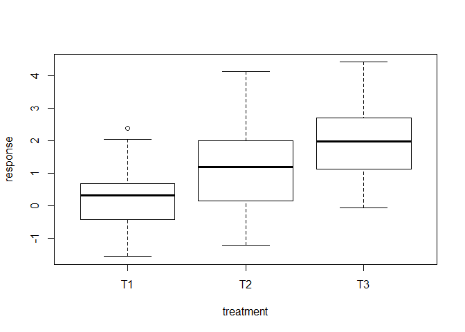

# Lab #4
Julian Stanley  
03 March 2018  


ANOVA


```r
# 30 of each of T1, T2, and T3. Response has 90 total: mean of 0, 1, and 2
my.dataframe <- data.frame(response = c(rnorm(30), rnorm(30, mean = 1), rnorm(30, mea = 2)), treatment = rep(c("T1", "T2", "T3"), each = 30))

head(my.dataframe)
```

```
##      response treatment
## 1  0.98096542        T1
## 2  0.95021976        T1
## 3 -0.02709988        T1
## 4  0.74990662        T1
## 5 -0.55236245        T1
## 6 -1.78149650        T1
```

```r
# Let's do an anova
model <- aov(response ~ treatment, data = my.dataframe)

# Check an anova's assumptions
par(mfrow = c(2, 2))
anovaPlot <- plot(model)
```

<!-- -->

```r
# Get an anova table
summary(model)
```

```
##             Df Sum Sq Mean Sq F value   Pr(>F)    
## treatment    2  59.12  29.558   28.84 2.46e-10 ***
## Residuals   87  89.16   1.025                     
## ---
## Signif. codes:  0 '***' 0.001 '**' 0.01 '*' 0.05 '.' 0.1 ' ' 1
```


```r
# Now let's do a post-hoc test to see what's different
mod.tukey <- TukeyHSD(model)
tukeyPlot <- plot(mod.tukey, las = 1)

# See all of our P values!
mod.tukey
```

```
##   Tukey multiple comparisons of means
##     95% family-wise confidence level
## 
## Fit: aov(formula = response ~ treatment, data = my.dataframe)
## 
## $treatment
##            diff       lwr      upr     p adj
## T2-T1 0.9983949 0.3751208 1.621669 0.0007254
## T3-T1 1.9851945 1.3619205 2.608469 0.0000000
## T3-T2 0.9867997 0.3635257 1.610074 0.0008442
```

```r
# Automatic letters!
require(multcompView)
```

```
## Loading required package: multcompView
```

```
## Warning: package 'multcompView' was built under R version 3.4.4
```

<!-- -->

```r
labels <- multcompLetters(mod.tukey$treatment[, "p adj"])$Letters
labels
```

```
##  T2  T3  T1 
## "a" "b" "c"
```

```r
labels <- labels[c("T1", "T2", "T3")]
labels
```

```
##  T1  T2  T3 
## "c" "a" "b"
```

```r
summary(model)
```

```
##             Df Sum Sq Mean Sq F value   Pr(>F)    
## treatment    2  59.12  29.558   28.84 2.46e-10 ***
## Residuals   87  89.16   1.025                     
## ---
## Signif. codes:  0 '***' 0.001 '**' 0.01 '*' 0.05 '.' 0.1 ' ' 1
```

```r
dataPlot <- plot(response ~ treatment, data = my.dataframe)
```

<!-- -->

```r
#text(x = dataPlot, y = c(4,4,4), labels, pos = 3)
```


Merging dataframes


```r
# Parens make it run and display all in one step
(dat1 <- data.frame(Year = 2000:2010, temp = c(rnorm(10), 0)))
```

```
##    Year       temp
## 1  2000 -0.5215854
## 2  2001  0.1731568
## 3  2002 -1.6776552
## 4  2003 -0.8399513
## 5  2004 -1.6199348
## 6  2005 -1.1008211
## 7  2006  2.4061357
## 8  2007 -0.8944736
## 9  2008  1.7391841
## 10 2009 -0.7559014
## 11 2010  0.0000000
```

```r
(dat2 <- data.frame(Year = 1999:2006, CO2 = c(rnorm(7), 0)))
```

```
##   Year        CO2
## 1 1999 -0.4342195
## 2 2000  0.8692554
## 3 2001 -1.3563584
## 4 2002 -0.4683003
## 5 2003 -1.2223379
## 6 2004 -0.4604674
## 7 2005 -0.1869165
## 8 2006  0.0000000
```

```r
# Only overlapping data
merge(dat1, dat2)
```

```
##   Year       temp        CO2
## 1 2000 -0.5215854  0.8692554
## 2 2001  0.1731568 -1.3563584
## 3 2002 -1.6776552 -0.4683003
## 4 2003 -0.8399513 -1.2223379
## 5 2004 -1.6199348 -0.4604674
## 6 2005 -1.1008211 -0.1869165
## 7 2006  2.4061357  0.0000000
```

```r
# Merge all data
merge(dat1, dat2, all.x = TRUE)
```

```
##    Year       temp        CO2
## 1  2000 -0.5215854  0.8692554
## 2  2001  0.1731568 -1.3563584
## 3  2002 -1.6776552 -0.4683003
## 4  2003 -0.8399513 -1.2223379
## 5  2004 -1.6199348 -0.4604674
## 6  2005 -1.1008211 -0.1869165
## 7  2006  2.4061357  0.0000000
## 8  2007 -0.8944736         NA
## 9  2008  1.7391841         NA
## 10 2009 -0.7559014         NA
## 11 2010  0.0000000         NA
```

```r
# Different? -- Includes 1999
merge(dat1, dat2, all.x = TRUE, all.y = TRUE)
```

```
##    Year       temp        CO2
## 1  1999         NA -0.4342195
## 2  2000 -0.5215854  0.8692554
## 3  2001  0.1731568 -1.3563584
## 4  2002 -1.6776552 -0.4683003
## 5  2003 -0.8399513 -1.2223379
## 6  2004 -1.6199348 -0.4604674
## 7  2005 -1.1008211 -0.1869165
## 8  2006  2.4061357  0.0000000
## 9  2007 -0.8944736         NA
## 10 2008  1.7391841         NA
## 11 2009 -0.7559014         NA
## 12 2010  0.0000000         NA
```

```r
# By x -- sorting by x on the second column. Looking for common values
?merge
```

```
## starting httpd help server ... done
```

```r
merge(dat1, dat2, by.x = 1, by.y = 1)
```

```
##   Year       temp        CO2
## 1 2000 -0.5215854  0.8692554
## 2 2001  0.1731568 -1.3563584
## 3 2002 -1.6776552 -0.4683003
## 4 2003 -0.8399513 -1.2223379
## 5 2004 -1.6199348 -0.4604674
## 6 2005 -1.1008211 -0.1869165
## 7 2006  2.4061357  0.0000000
```


Task 1
--------------


```r
# Download the dataset
d1 <- read.csv("http://faraway.neu.edu/data/lab5_dataset1.csv")

# Inspect the dataset
head(d1)
```

```
##   treatment mortality
## 1   control  1.452878
## 2   control  3.266253
## 3   control  1.178652
## 4   control 13.400350
## 5   control  3.779183
## 6   control  1.196657
```

```r
summary(d1)
```

```
##    treatment    mortality      
##  control:30   Min.   : 0.2968  
##  t1     :30   1st Qu.: 2.3771  
##  t2     :30   Median : 5.1066  
##  t3     :30   Mean   : 8.3900  
##  t4     :30   3rd Qu.: 9.0763  
##               Max.   :98.2157
```


### Problem 1
$$H_0:$$ There is no difference between the pairwise comparisons between control, t1, t2, t3, and t4.
$$H_a:$$ There is some difference between the pairwise comparisons between control, t1, t2, t3, and t4.

### Problem 2


```r
# Make sure the data is actually normally distributed
hist(d1$mortality)
```

<!-- -->

```r
shapiro.test(d1$mortality)
```

```
## 
## 	Shapiro-Wilk normality test
## 
## data:  d1$mortality
## W = 0.50776, p-value < 2.2e-16
```

The data is not normally distributed

### Problem 3

```r
d1Log <- d1
d1Log$mortality <- log10(d1$mortality)
hist(d1Log$mortality)
```

<!-- -->

```r
shapiro.test(d1Log$mortality)
```

```
## 
## 	Shapiro-Wilk normality test
## 
## data:  d1Log$mortality
## W = 0.9908, p-value = 0.4389
```

A log10 transformation makes the data normal.

### Problem 4

```r
# Anova with the log10 data
task1Model <- aov(mortality ~ treatment, data = d1Log)
```

### Problem 5

```r
# Summary of the anove
summary(task1Model)
```

```
##              Df Sum Sq Mean Sq F value   Pr(>F)    
## treatment     4  6.316  1.5790   10.36 2.07e-07 ***
## Residuals   145 22.093  0.1524                     
## ---
## Signif. codes:  0 '***' 0.001 '**' 0.01 '*' 0.05 '.' 0.1 ' ' 1
```

Conclusion: there is a significant difference between some of the pairwise comparisons between the 5 categories.

### Problem 6

Tukey adjusts the p-value to compensate for the p-value inflation that multiple comparisons would cause. 

### Problem 7


```r
# Tukey poc-hoc analysis
task1Tukey <- TukeyHSD(task1Model)
task1Tukey
```

```
##   Tukey multiple comparisons of means
##     95% family-wise confidence level
## 
## Fit: aov(formula = mortality ~ treatment, data = d1Log)
## 
## $treatment
##                   diff         lwr        upr     p adj
## t1-control  0.15214049 -0.12626892  0.4305499 0.5579834
## t2-control  0.44637650  0.16796710  0.7247859 0.0001783
## t3-control  0.01340866 -0.26500074  0.2918181 0.9999286
## t4-control  0.47230123  0.19389183  0.7507106 0.0000618
## t2-t1       0.29423601  0.01582661  0.5726454 0.0326526
## t3-t1      -0.13873182 -0.41714122  0.1396776 0.6436534
## t4-t1       0.32016074  0.04175134  0.5985701 0.0154223
## t3-t2      -0.43296783 -0.71137723 -0.1545584 0.0003031
## t4-t2       0.02592473 -0.25248467  0.3043341 0.9990258
## t4-t3       0.45889256  0.18048316  0.7373020 0.0001075
```


### Problem 8

```r
# Visualize the tukey
plot(task1Tukey, las = 1)
```

<!-- -->

### Problem 9 & 10


```r
# Generate letters
require(multcompView)
labels <- multcompLetters(task1Tukey$treatment[, "p adj"])$Letters
labels <- labels[c("control", "t1", "t2", "t3", "t4")]
```


### Problem 11

```r
# Aggregate the mean mortality by treatment
task1Means <- aggregate(mortality ~ treatment, FUN = mean, data = d1)
task1Means
```

```
##   treatment mortality
## 1   control  4.116683
## 2        t1  5.755054
## 3        t2 13.517457
## 4        t3  4.508035
## 5        t4 14.052996
```

Chunk one: find the confidence intervals of everything

```r
# Define a one-line function that takes in a numeric vector and returns the standard error of that vector
se <- function(x) sqrt(var(x)/length(x))

# Find the standard errors of each 
task1All <- data.frame(subset(d1, treatment == "control")$mortality,
              subset(d1, treatment == "t1")$mortality,
              subset(d1, treatment == "t2")$mortality,
              subset(d1, treatment == "t3")$mortality,
              subset(d1, treatment == "t4")$mortality)

treatments <- c("control", "t1", "t2", "t3", "t4")

# Another way to generate the same task1All dataframe, just more fun/scalable
task1All2 <- data.frame(1:30)

for(t in treatments) {
  task1All2 <- cbind(task1All2, subset(d1, treatment == t)$mortality)
}

task1All2 <- task1All2[2:6]
colnames(task1All2) <- treatments

# Define a function that takes in a numeric vector and returns the 95% confidence interval of that vector
conInt <- function(x) c(mean(x) - (qnorm(0.975) * se(x)), mean(x) + (qnorm(0.975) * se(x)))


# Find the confidence intervals
conIntList <- c()
for(column in names(task1All)) {
  conIntList <- c(conIntList,(conInt(task1All[,column])))
}
```

Second chunk: plot the barplot with confidence intervals and labels

```r
# Plot the mortality by treatment
mortBar <- barplot(task1Means$mortality, names = task1Means$treatment, xlab = "Treatment Condition", ylab = "Mortality", main = "Mortality by Treatment", ylim = c(0, 30))
mortBar
```

```
##      [,1]
## [1,]  0.7
## [2,]  1.9
## [3,]  3.1
## [4,]  4.3
## [5,]  5.5
```

```r
arrows(x0 = mortBar, y0 = c(conIntList[1], conIntList[3], conIntList[5], conIntList[7], conIntList[9]) , x1 = mortBar, y1 = c(conIntList[2], conIntList[4], conIntList[6], conIntList[8], conIntList[10]), angle = 90, code = 3)

text(x = mortBar, y = c(conIntList[2], conIntList[4], conIntList[6], conIntList[8], conIntList[10]), labels, pos = 3)
```

<!-- -->

### Problem 12
Treatments 2 and 4 seem best at reducing mortality

Task 2
--------------


```r
# Download the data
d2 <- read.csv("http://faraway.neu.edu/data/lab5_dataset2.csv")

summary(d2)
```

```
##    treatment    mortality      
##  control:30   Min.   : 0.2968  
##  t1     :30   1st Qu.: 1.9809  
##  t2     :30   Median : 3.8587  
##  t3     :30   Mean   : 6.6003  
##  t4     :30   3rd Qu.: 7.7646  
##               Max.   :81.5827
```


### Problem 1

```r
shapiro.test(d2$mortality)
```

```
## 
## 	Shapiro-Wilk normality test
## 
## data:  d2$mortality
## W = 0.51851, p-value < 2.2e-16
```

```r
hist(d2$mortality)
```

<!-- -->

```r
# Log transform
d2_log <- d2
d2_log$mortality <- log10(d2_log$mortality)

hist(d2_log$mortality)
```

<!-- -->

```r
# Run the anova
task2Model <- aov(mortality ~ treatment, data = d2_log)

summary(task2Model)
```

```
##              Df Sum Sq Mean Sq F value   Pr(>F)    
## treatment     4  5.745  1.4362   9.426 8.42e-07 ***
## Residuals   145 22.093  0.1524                     
## ---
## Signif. codes:  0 '***' 0.001 '**' 0.01 '*' 0.05 '.' 0.1 ' ' 1
```

```r
par(mfrow = c(2,2))
plot(task2Model)
```

<!-- -->
The ANOVA table suggests that the mean mortality is different across treatments.

### Problem 2


```r
# Tukey poc-hoc analysis
task2Tukey <- TukeyHSD(task2Model)
task2Tukey
```

```
##   Tukey multiple comparisons of means
##     95% family-wise confidence level
## 
## Fit: aov(formula = mortality ~ treatment, data = d2_log)
## 
## $treatment
##                   diff         lwr         upr     p adj
## t1-control  0.23899938 -0.03941002  0.51740878 0.1291508
## t2-control  0.44637650  0.16796710  0.72478590 0.0001783
## t3-control  0.01340866 -0.26500074  0.29181806 0.9999286
## t4-control -0.09228160 -0.37069100  0.18612780 0.8905013
## t2-t1       0.20737711 -0.07103229  0.48578651 0.2443410
## t3-t1      -0.22559072 -0.50400012  0.05281868 0.1716297
## t4-t1      -0.33128098 -0.60969038 -0.05287158 0.0109690
## t3-t2      -0.43296783 -0.71137723 -0.15455843 0.0003031
## t4-t2      -0.53865809 -0.81706749 -0.26024869 0.0000034
## t4-t3      -0.10569026 -0.38409966  0.17271914 0.8321379
```

```r
plot(task2Tukey, las = 1)
```

<!-- -->


### Problem 3


```r
# Generate letters
require(multcompView)
labels <- multcompLetters(task2Tukey$treatment[, "p adj"])$Letters
labels <- labels[c("control", "t1", "t2", "t3", "t4")]
```


Chunk one: find the confidence intervals of everything

```r
# Aggregate the mean mortality by treatment
task2Means <- aggregate(mortality ~ treatment, FUN = mean, data = d2)
task2Means
```

```
##   treatment mortality
## 1   control  4.116683
## 2        t1  7.029239
## 3        t2 13.517457
## 4        t3  4.508035
## 5        t4  3.829888
```

```r
# Define a one-line function that takes in a numeric vector and returns the standard error of that vector
se <- function(x) sqrt(var(x)/length(x))

# Find the standard errors of each 
task2All <- data.frame(subset(d2, treatment == "control")$mortality,
              subset(d2, treatment == "t1")$mortality,
              subset(d2, treatment == "t2")$mortality,
              subset(d2, treatment == "t3")$mortality,
              subset(d2, treatment == "t4")$mortality)

treatments <- c("control", "t1", "t2", "t3", "t4")

# Define a function that takes in a numeric vector and returns the 95% confidence interval of that vector
conInt <- function(x) c(mean(x) - (qnorm(0.975) * se(x)), mean(x) + (qnorm(0.975) * se(x)))


# Find the confidence intervals
conIntList <- c()
for(column in names(task2All)) {
  conIntList <- c(conIntList,(conInt(task2All[,column])))
}
```

Second chunk: plot the barplot with confidence intervals and labels

```r
# Plot the mortality by treatment
mortBar <- barplot(task2Means$mortality, names = task2Means$treatment, xlab = "Treatment Condition", ylab = "Mortality", main = "Mortality by Treatment", ylim = c(0, 30))
mortBar
```

```
##      [,1]
## [1,]  0.7
## [2,]  1.9
## [3,]  3.1
## [4,]  4.3
## [5,]  5.5
```

```r
arrows(x0 = mortBar, y0 = c(conIntList[1], conIntList[3], conIntList[5], conIntList[7], conIntList[9]) , x1 = mortBar, y1 = c(conIntList[2], conIntList[4], conIntList[6], conIntList[8], conIntList[10]), angle = 90, code = 3)

text(x = mortBar, y = c(conIntList[2], conIntList[4], conIntList[6], conIntList[8], conIntList[10]), labels, pos = 3)
```

<!-- -->

Since treatment 2 also kills the predators of the pests, we should use treatment 4! :)
