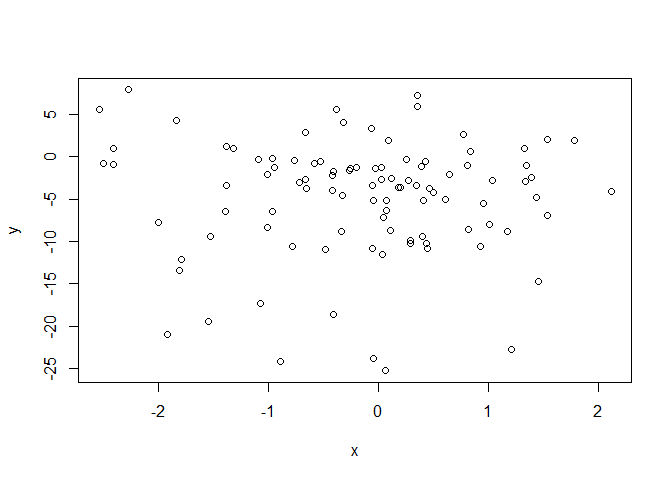
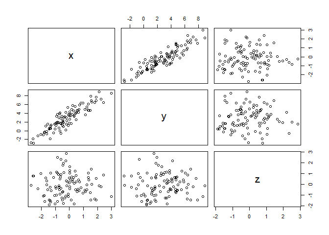
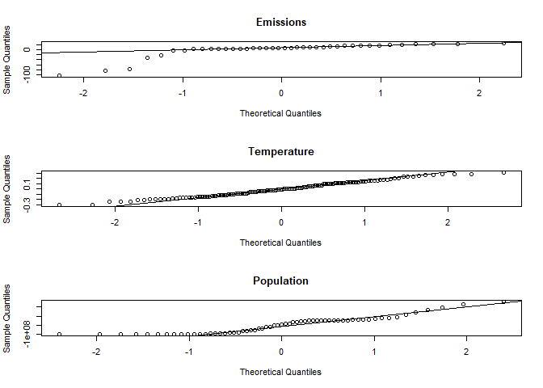

# Lab #6
Julian Stanley  
30 March 2018  


Introductory Matter
---------------

Merging review

```r
# Parens make it run and display all in one step
(dat1 <- data.frame(Year = 2000:2010, temp = c(rnorm(10), 0)))
```

```
##    Year       temp
## 1  2000 -0.9758633
## 2  2001 -1.2405801
## 3  2002 -0.3276542
## 4  2003  0.4998030
## 5  2004 -2.1922365
## 6  2005  0.4080289
## 7  2006  0.5882279
## 8  2007  1.1993700
## 9  2008 -0.9800784
## 10 2009 -0.2302686
## 11 2010  0.0000000
```

```r
(dat2 <- data.frame(Year = 1999:2006, CO2 = c(rnorm(7), 0)))
```

```
##   Year         CO2
## 1 1999 -0.34076644
## 2 2000  0.93515948
## 3 2001 -0.64964098
## 4 2002  0.51856096
## 5 2003 -1.02291201
## 6 2004  0.77634453
## 7 2005 -0.02719303
## 8 2006  0.00000000
```

```r
# Only overlapping data
merge(dat1, dat2)
```

```
##   Year       temp         CO2
## 1 2000 -0.9758633  0.93515948
## 2 2001 -1.2405801 -0.64964098
## 3 2002 -0.3276542  0.51856096
## 4 2003  0.4998030 -1.02291201
## 5 2004 -2.1922365  0.77634453
## 6 2005  0.4080289 -0.02719303
## 7 2006  0.5882279  0.00000000
```

```r
# Merge all data
merge(dat1, dat2, all.x = TRUE)
```

```
##    Year       temp         CO2
## 1  2000 -0.9758633  0.93515948
## 2  2001 -1.2405801 -0.64964098
## 3  2002 -0.3276542  0.51856096
## 4  2003  0.4998030 -1.02291201
## 5  2004 -2.1922365  0.77634453
## 6  2005  0.4080289 -0.02719303
## 7  2006  0.5882279  0.00000000
## 8  2007  1.1993700          NA
## 9  2008 -0.9800784          NA
## 10 2009 -0.2302686          NA
## 11 2010  0.0000000          NA
```

```r
# Different? -- Includes 1999
merge(dat1, dat2, all.x = TRUE, all.y = TRUE)
```

```
##    Year       temp         CO2
## 1  1999         NA -0.34076644
## 2  2000 -0.9758633  0.93515948
## 3  2001 -1.2405801 -0.64964098
## 4  2002 -0.3276542  0.51856096
## 5  2003  0.4998030 -1.02291201
## 6  2004 -2.1922365  0.77634453
## 7  2005  0.4080289 -0.02719303
## 8  2006  0.5882279  0.00000000
## 9  2007  1.1993700          NA
## 10 2008 -0.9800784          NA
## 11 2009 -0.2302686          NA
## 12 2010  0.0000000          NA
```

```r
# By x -- sorting by x on the second column. Looking for common values
merge(dat1, dat2, by.x = 1, by.y = 1)
```

```
##   Year       temp         CO2
## 1 2000 -0.9758633  0.93515948
## 2 2001 -1.2405801 -0.64964098
## 3 2002 -0.3276542  0.51856096
## 4 2003  0.4998030 -1.02291201
## 5 2004 -2.1922365  0.77634453
## 6 2005  0.4080289 -0.02719303
## 7 2006  0.5882279  0.00000000
```

Linear Regression

```r
# Create some normal data
x <- rnorm(100)
y <- 2 * x + 3 + rnorm(length(x))
plot(x,y)
```

<!-- -->

```r
# Create a linear model
mylm <- lm(y ~ x)
```
Conclusion: Data looks linear

Test for normality of residuals 

```r
# Shapiro-Wilks test of residuals
shapiro.test(mylm$residuals)
```

```
## 
## 	Shapiro-Wilk normality test
## 
## data:  mylm$residuals
## W = 0.99451, p-value = 0.9602
```

```r
# Visualize assumption plots
par(mfrow = c(2, 2))
plot(mylm)
```

<!-- -->

```r
# Plot QQ Plots
par(mfrow = c(1, 1))
qqnorm(mylm$residuals)
qqline(mylm$residuals)
```

<!-- -->
Conclusion: Normal samples

Use autocorrelation function to test for independence in residuals

```r
acf(mylm$residuals)
```

<!-- -->

Conclusion: Independent samples

Sumarize the model

```r
mysum <- summary(mylm)
mysum
```

```
## 
## Call:
## lm(formula = y ~ x)
## 
## Residuals:
##      Min       1Q   Median       3Q      Max 
## -2.19274 -0.51563 -0.00247  0.54910  2.25645 
## 
## Coefficients:
##             Estimate Std. Error t value Pr(>|t|)    
## (Intercept)  2.93099    0.08847   33.13   <2e-16 ***
## x            2.13060    0.09288   22.94   <2e-16 ***
## ---
## Signif. codes:  0 '***' 0.001 '**' 0.01 '*' 0.05 '.' 0.1 ' ' 1
## 
## Residual standard error: 0.8696 on 98 degrees of freedom
## Multiple R-squared:  0.843,	Adjusted R-squared:  0.8414 
## F-statistic: 526.2 on 1 and 98 DF,  p-value: < 2.2e-16
```

Conclusion: LM fits the data well

### Data 2: Non-normal data

Linear Regression

```r
# Create some normal data
x <- rnorm(100)
y <- exp(2*x) + 3 + rnorm(100)
plot(x,y)
```

<!-- -->

```r
# Create a linear model
mylm <- lm(y ~ x)
```
Conclusion: Data looks exponential

Test for normality of residuals 

```r
# Shapiro-Wilks test of residuals
shapiro.test(mylm$residuals)
```

```
## 
## 	Shapiro-Wilk normality test
## 
## data:  mylm$residuals
## W = 0.74929, p-value = 8.966e-12
```

```r
# Visualize assumption plots
par(mfrow = c(2, 2))
plot(mylm)
```

<!-- -->

```r
# Plot QQ Plots
par(mfrow = c(1, 1))
qqnorm(mylm$residuals)
qqline(mylm$residuals)
```

<!-- -->
Conclusion: Samples are not normal

Use autocorrelation function to test for independence in residuals

```r
acf(mylm$residuals)
```

<!-- -->

Conclusion: Independent samples

Sumarize the model

```r
mysum <- summary(mylm)
mysum
```

```
## 
## Call:
## lm(formula = y ~ x)
## 
## Residuals:
##    Min     1Q Median     3Q    Max 
## -6.500 -3.613 -1.707  1.403 32.789 
## 
## Coefficients:
##             Estimate Std. Error t value Pr(>|t|)    
## (Intercept)   7.7320     0.6232  12.406  < 2e-16 ***
## x             5.6128     0.6052   9.275 4.54e-15 ***
## ---
## Signif. codes:  0 '***' 0.001 '**' 0.01 '*' 0.05 '.' 0.1 ' ' 1
## 
## Residual standard error: 6.179 on 98 degrees of freedom
## Multiple R-squared:  0.4675,	Adjusted R-squared:  0.462 
## F-statistic: 86.02 on 1 and 98 DF,  p-value: 4.537e-15
```
Conclusion: Linear model has a relatively poor fit

### Data 3: Autocorrelated data

Linear Regression

```r
# Create some normal data
x <- rnorm(100)
y <- 2*diffinv(x[1:99]) + 3 + rnorm(100)
plot(x,y)
```

<!-- -->

```r
# Create a linear model
mylm <- lm(y ~ x)
```
Conclusion: Data looks scattered

Test for normality of residuals 

```r
# Shapiro-Wilks test of residuals
shapiro.test(mylm$residuals)
```

```
## 
## 	Shapiro-Wilk normality test
## 
## data:  mylm$residuals
## W = 0.92666, p-value = 3.233e-05
```

```r
# Visualize assumption plots
par(mfrow = c(2, 2))
plot(mylm)
```

<!-- -->

```r
# Plot QQ Plots
par(mfrow = c(1, 1))
qqnorm(mylm$residuals)
qqline(mylm$residuals)
```

<!-- -->
Conclusion: Samples are not normal

Use autocorrelation function to test for independence in residuals

```r
acf(mylm$residuals)
```

<!-- -->

Conclusion: Non-independent samples

Sumarize the model

```r
mysum <- summary(mylm)
mysum
```

```
## 
## Call:
## lm(formula = y ~ x)
## 
## Residuals:
##     Min      1Q  Median      3Q     Max 
## -20.465  -3.716   1.380   3.958  12.500 
## 
## Coefficients:
##             Estimate Std. Error t value Pr(>|t|)    
## (Intercept)  -4.8284     0.6952  -6.945 4.17e-10 ***
## x            -0.1123     0.6672  -0.168    0.867    
## ---
## Signif. codes:  0 '***' 0.001 '**' 0.01 '*' 0.05 '.' 0.1 ' ' 1
## 
## Residual standard error: 6.886 on 98 degrees of freedom
## Multiple R-squared:  0.0002893,	Adjusted R-squared:  -0.009912 
## F-statistic: 0.02835 on 1 and 98 DF,  p-value: 0.8666
```
Conclusion: Linear model fits very poorly

### More introduction

Back to original data


```r
# Create some normal data
x <- rnorm(100)
y <- 2 * x + 3 + rnorm(length(x))
plot(x,y)
```

<!-- -->

```r
# Create a linear model
mylm <- lm(y ~ x)
```

Coefficients and confidence intervals

```r
coef(mylm)
```

```
## (Intercept)           x 
##    3.206023    1.955164
```

```r
confint(mylm)
```

```
##                2.5 %   97.5 %
## (Intercept) 2.986625 3.425422
## x           1.769470 2.140858
```


Extrapolate the linear model

```r
summary(x)
```

```
##    Min. 1st Qu.  Median    Mean 3rd Qu.    Max. 
## -2.7325 -0.9140 -0.2395 -0.1668  0.4951  3.0022
```

```r
newx <- data.frame(x = -5:5)
(my.predict <- predict(mylm, newdata = newx, interval = "conf"))
```

```
##           fit        lwr        upr
## 1  -6.5697985 -7.4932002 -5.6463969
## 2  -4.6146342 -5.3588347 -3.8704336
## 3  -2.6594698 -3.2286472 -2.0902924
## 4  -0.7043054 -1.1081072 -0.3005037
## 5   1.2508589  0.9841879  1.5175300
## 6   3.2060233  2.9866249  3.4254218
## 7   5.1611877  4.8543938  5.4679816
## 8   7.1163521  6.6591060  7.5735981
## 9   9.0715164  8.4446273  9.6984056
## 10 11.0266808 10.2230201 11.8303416
## 11 12.9818452 11.9981197 13.9655707
```

```r
# Plot prediction with confidence intervals
plot(x, y, xlim = c(-5, 5))
points(newx$x, my.predict[, "fit"], type = "l", col = "red")
points(newx$x, my.predict[, "upr"], type = "l", lty = 2, col = "pink")
points(newx$x, my.predict[, "lwr"], type = "l", lty = 2, col = "pink")
```

<!-- -->

Correlation of multiple variables at once

```r
z <- rnorm(100)
mycor <- data.frame(x, y, z)

# Pearson's correlation
cor(mycor)
```

```
##             x          y           z
## x 1.000000000 0.90370160 0.004989232
## y 0.903701602 1.00000000 0.033852967
## z 0.004989232 0.03385297 1.000000000
```

```r
# Plot relationships among all columns
pairs(mycor)
```

<!-- -->

Multiple regression time!

```r
summary(lm(y ~ x + z, data = mycor))
```

```
## 
## Call:
## lm(formula = y ~ x + z, data = mycor)
## 
## Residuals:
##      Min       1Q   Median       3Q      Max 
## -2.80721 -0.63038 -0.00242  0.62818  2.29800 
## 
## Coefficients:
##             Estimate Std. Error t value Pr(>|t|)    
## (Intercept)  3.20930    0.11097  28.920   <2e-16 ***
## x            1.95485    0.09383  20.833   <2e-16 ***
## z            0.07073    0.10454   0.677      0.5    
## ---
## Signif. codes:  0 '***' 0.001 '**' 0.01 '*' 0.05 '.' 0.1 ' ' 1
## 
## Residual standard error: 1.098 on 97 degrees of freedom
## Multiple R-squared:  0.8175,	Adjusted R-squared:  0.8138 
## F-statistic: 217.3 on 2 and 97 DF,  p-value: < 2.2e-16
```

Z is not linear, and therefore it does not add much to the linear regression. That is shown in the table above, where the Pr(>|t|) of z > 0.05.


Task 1
--------


```r
co2 <- read.table("http://faraway.neu.edu/data/lab7_co2.txt", header = TRUE)
temp <- read.csv("http://faraway.neu.edu/data/lab7_temp.csv")
pop <- read.csv("http://faraway.neu.edu/data/lab7_population.csv")
```

### Exercise 1


```r
# What is in our datasets?
str(co2)
```

```
## 'data.frame':	2049 obs. of  9 variables:
##  $ year        : int  1974 1974 1974 1974 1974 1974 1974 1974 1974 1974 ...
##  $ month       : int  5 5 6 6 6 6 6 7 7 7 ...
##  $ day         : int  19 26 2 9 16 23 30 7 14 21 ...
##  $ decimalyear : num  1974 1974 1974 1974 1974 ...
##  $ ppm         : num  333 333 332 332 332 ...
##  $ days        : int  7 6 5 7 7 7 7 7 7 7 ...
##  $ one.year.ago: num  -1000 -1000 -1000 -1000 -1000 ...
##  $ ten.year.ago: num  -1000 -1000 -1000 -1000 -1000 ...
##  $ since.1800  : num  50.3 50.1 49.4 49.6 50 ...
```

```r
str(temp)
```

```
## 'data.frame':	132 obs. of  13 variables:
##  $ Year: int  1881 1882 1883 1884 1885 1886 1887 1888 1889 1890 ...
##  $ Jan : num  13.9 14 13.6 13.8 13.4 ...
##  $ Feb : num  13.8 14.1 13.6 13.9 13.7 ...
##  $ Mar : num  14 14 13.9 13.7 13.8 ...
##  $ Apr : num  14 13.8 13.8 13.6 13.6 ...
##  $ May : num  14 13.8 13.8 13.7 13.7 ...
##  $ Jun : num  13.8 13.7 13.9 13.6 13.6 ...
##  $ Jul : num  13.9 13.7 14 13.7 13.7 ...
##  $ Aug : num  13.9 13.9 13.9 13.8 13.8 ...
##  $ Sep : num  13.8 13.9 13.8 13.7 13.8 ...
##  $ Oct : num  13.8 13.8 13.8 13.8 13.9 ...
##  $ Nov : num  13.7 13.8 13.7 13.7 13.9 ...
##  $ Dec : num  13.8 13.6 13.8 13.8 14 ...
```

```r
str(pop)
```

```
## 'data.frame':	61 obs. of  2 variables:
##  $ year   : int  1950 1951 1952 1953 1954 1955 1956 1957 1958 1959 ...
##  $ popsize: num  2.53e+09 2.57e+09 2.62e+09 2.67e+09 2.71e+09 ...
```

```r
# What do our datasets look like?
head(co2)
```

```
##   year month day decimalyear    ppm days one.year.ago ten.year.ago
## 1 1974     5  19    1974.380 333.29    7      -999.99      -999.99
## 2 1974     5  26    1974.399 332.94    6      -999.99      -999.99
## 3 1974     6   2    1974.418 332.16    5      -999.99      -999.99
## 4 1974     6   9    1974.437 332.16    7      -999.99      -999.99
## 5 1974     6  16    1974.456 332.27    7      -999.99      -999.99
## 6 1974     6  23    1974.475 331.71    7      -999.99      -999.99
##   since.1800
## 1      50.31
## 2      50.06
## 3      49.43
## 4      49.63
## 5      49.99
## 6      49.73
```

```r
head(temp)
```

```
##   Year   Jan   Feb   Mar   Apr   May   Jun   Jul   Aug   Sep   Oct   Nov
## 1 1881 13.87 13.84 13.98 13.98 13.98 13.75 13.89 13.93 13.83 13.78 13.73
## 2 1882 14.03 14.05 13.99 13.77 13.81 13.69 13.74 13.90 13.89 13.75 13.75
## 3 1883 13.62 13.62 13.88 13.81 13.80 13.93 13.98 13.87 13.81 13.81 13.72
## 4 1884 13.81 13.86 13.70 13.65 13.67 13.65 13.69 13.76 13.72 13.75 13.71
## 5 1885 13.44 13.72 13.82 13.64 13.66 13.61 13.73 13.76 13.83 13.86 13.87
## 6 1886 13.63 13.58 13.67 13.77 13.79 13.71 13.89 13.80 13.88 13.78 13.73
##     Dec
## 1 13.83
## 2 13.63
## 3 13.80
## 4 13.75
## 5 14.02
## 6 13.84
```

```r
head(pop)
```

```
##   year    popsize
## 1 1950 2525779000
## 2 1951 2572851000
## 3 1952 2619292000
## 4 1953 2665865000
## 5 1954 2713172000
## 6 1955 2761651000
```

```r
# What range of years do our datasets cover?
range(co2$year)
```

```
## [1] 1974 2013
```

```r
range(temp$Year)
```

```
## [1] 1881 2012
```

```r
range(pop$year)
```

```
## [1] 1950 2010
```


### Exercise 2

Reshape the dataset to long

```r
temp.long <- reshape(temp, varying = list(2:13), idvar = "Year", direction = "long")
colnames(temp.long) <- c("year", "month", "temp")
```

### Exercise 3


```r
co2Agg <- aggregate(co2$ppm, FUN = mean, by = list(co2$year))
colnames(co2Agg) <- c("Year", "Emissions (ppm)")

tempAgg <- aggregate(temp.long$temp, FUN = mean, by = list(temp.long$year))
colnames(tempAgg) <- c("Year", "Temperature (C)")

popAgg <- aggregate(pop$popsize, FUN = mean, by = list(pop$year))
colnames(popAgg) <- c("Year", "Population Size")

head(co2Agg)
```

```
##   Year Emissions (ppm)
## 1 1974        329.4779
## 2 1975        203.1813
## 3 1976        306.4163
## 4 1977        333.7863
## 5 1978        335.4104
## 6 1979        311.0765
```

```r
head(tempAgg)
```

```
##   Year Temperature (C)
## 1 1881        13.86583
## 2 1882        13.83333
## 3 1883        13.80417
## 4 1884        13.72667
## 5 1885        13.74667
## 6 1886        13.75583
```

```r
head(popAgg)
```

```
##   Year Population Size
## 1 1950      2525779000
## 2 1951      2572851000
## 3 1952      2619292000
## 4 1953      2665865000
## 5 1954      2713172000
## 6 1955      2761651000
```

### Exercise 4
Merge the datasets


```r
merge <- merge(merge(tempAgg, co2Agg, all.x = TRUE, all.y = TRUE), popAgg, all.x = TRUE, all.y = TRUE)
```


Task 2
-------------

### Exercise 1

$H_{0t}$: There is no linear relationship between year and temperature

$H_{0e}$: There is no linear relationship between year and emissions

$H_{0p}$: There is no linear relationship between year and population

$H_{at}$: There is a linear relationship between year and tempearture

$H_{ae}$: There is a linear relationship between year and emissions

$H_{ap}$: There is a linear relationship between year and population

### Exercise 2

```r
par(mfrow = c(3,1))
plot(`Emissions (ppm)` ~ Year, data = co2Agg, main = "CO2 by Year")
plot(`Temperature (C)` ~ Year, data = tempAgg, main = "Temperature by Year")
plot(`Population Size` ~ Year, data = popAgg, main = "Population by Year")
```

<!-- -->

Population looks nearly perfectly linear. Temperature looks approximately linear and CO2 seems not-quite-linear.

### Exercise 3
Create some linear models

```r
lmEmission <- lm(`Emissions (ppm)` ~ Year, data = co2Agg)
lmTemp <- lm(`Temperature (C)` ~ Year, data = tempAgg)
lmPop <- lm(`Population Size` ~ Year, data = popAgg)
```


### Exercise 4

We really should check some assumptions, since that would be nice.

1) Check Linearity
We checked linearity by-eye in exercise 2

2) Check Normality

```r
par(mfrow = c(3,1))
qqnorm(lmEmission$residuals, main = "Emissions")
qqline(lmEmission$residuals)
qqnorm(lmTemp$residuals, main = "Temperature")
qqline(lmTemp$residuals)
qqnorm(lmPop$residuals, main = "Population")
qqline(lmPop$residuals)
```

<!-- -->

```r
# Formal test
shapiro.test(lmEmission$residuals)
```

```
## 
## 	Shapiro-Wilk normality test
## 
## data:  lmEmission$residuals
## W = 0.62351, p-value = 6.646e-09
```

```r
shapiro.test(lmTemp$residuals)
```

```
## 
## 	Shapiro-Wilk normality test
## 
## data:  lmTemp$residuals
## W = 0.98464, p-value = 0.1441
```

```r
shapiro.test(lmPop$residuals)
```

```
## 
## 	Shapiro-Wilk normality test
## 
## data:  lmPop$residuals
## W = 0.89454, p-value = 7.355e-05
```


Temperature looks quite normal, but the others are very much not normal


3) Check homoscedasicity

```r
# Visualize assumption plots
par(mfrow = c(2, 2))
plot(lmEmission)
```

<!-- -->

```r
# Visualize assumption plots
par(mfrow = c(2, 2))
plot(lmTemp)
```

<!-- -->

```r
# Visualize assumption plots
par(mfrow = c(2, 2))
```


### Exercise 5

Does a log transformation improve any of the non-linear data?

```r
logCo2Agg <- co2Agg
logPopAgg <- popAgg
logTempAgg <- tempAgg

logCo2Agg$`Emissions (ppm)` <- log(logCo2Agg$`Emissions (ppm)`)
logPopAgg$`Population Size` <- log(logPopAgg$`Population Size`)
logTempAgg$`Temperature (C)` <- log(logTempAgg$`Temperature (C)`)
```


Refit the models

```r
lmLogEmission <- lm(`Emissions (ppm)` ~ Year, data = logCo2Agg)
lmLogTemp <- lm(`Temperature (C)` ~ Year, data = logTempAgg)
lmLogPop <- lm(`Population Size` ~ Year, data = logPopAgg)
```


2) Check Normality

```r
par(mfrow = c(3,1))
qqnorm(lmLogEmission$residuals, main = "Emissions")
qqline(lmLogEmission$residuals)
qqnorm(lmLogTemp$residuals, main = "Temperature")
qqline(lmLogTemp$residuals)
qqnorm(lmLogPop$residuals, main = "Population")
qqline(lmLogPop$residuals)
```

<!-- -->

```r
# Formal test
shapiro.test(lmLogEmission$residuals)
```

```
## 
## 	Shapiro-Wilk normality test
## 
## data:  lmLogEmission$residuals
## W = 0.62295, p-value = 6.525e-09
```

```r
shapiro.test(lmLogTemp$residuals)
```

```
## 
## 	Shapiro-Wilk normality test
## 
## data:  lmLogTemp$residuals
## W = 0.98571, p-value = 0.1843
```

```r
shapiro.test(lmLogPop$residuals)
```

```
## 
## 	Shapiro-Wilk normality test
## 
## data:  lmLogPop$residuals
## W = 0.91225, p-value = 0.0003379
```
Temperature looks quite normal, but the others are very much not normal


3) Check homoscedasicity

```r
# Visualize assumption plots
par(mfrow = c(2, 2))
plot(lmLogEmission)
```

<!-- -->

```r
# Visualize assumption plots
par(mfrow = c(2, 2))
plot(lmLogTemp)
```

<!-- -->

```r
# Visualize assumption plots
par(mfrow = c(2, 2))
plot(lmLogPop)
```

<!-- -->

Log transformation doesn't really help much

### Exercise 7
Raw is just about as normally distributed as log transformed data. Only temperature is normally distributed in both cases.

### Exercise 8
When we extrapolate, we assume that the trends that we have seen so far will continue. This is an unfounded assumption. A counterexample of this assumption would be if we created a linear model for temperature from November-February. In Boston, this model would show that temperature decreases from November-February. If we extrapolated this model into June, we would errenously expect June to be quite cold. 

### Exercise 9 and 10


```r
newYear <- data.frame(Year = 1880:2050)
TempPredict <- predict(lmTemp, newdata = newYear, interval = "conf")
EmissionPredict <- predict(lmEmission, newdata = newYear, interval = "conf")
PopPredict <- predict(lmPop, newdata = newYear, interval = "conf")


# Plot prediction with confidence intervals
par(mfrow = c(3, 1))

## Emission
plot(co2Agg$Year, co2Agg$`Emissions (ppm)`, xlim = c(1880, 2050), ylim = c(0, 600))
points(newYear$Year, EmissionPredict[, "fit"], type = "l", lwd = 2, col = "red")
points(newYear$Year, EmissionPredict[, "upr"], type = "l", lty = 2, col = "red")
points(newYear$Year, EmissionPredict[, "lwr"], type = "l", lty = 2, col = "red")

## Temperature
plot(tempAgg$Year, tempAgg$`Temperature (C)`, xlim = c(1880, 2050), ylim = c(13, 15))
points(newYear$Year, TempPredict[, "fit"], type = "l", lwd = 2, col = "red")
points(newYear$Year, TempPredict[, "upr"], type = "l", lty = 2, col = "red")
points(newYear$Year, TempPredict[, "lwr"], type = "l", lty = 2, col = "red")

## Population
plot(popAgg$Year, popAgg$`Population Size`, xlim = c(1880, 2050), ylim = c(0, 10E9))
points(newYear$Year, PopPredict[, "fit"], type = "l", lwd = 2, col = "red")
points(newYear$Year, PopPredict[, "upr"], type = "l", lty = 2, col = "red")
points(newYear$Year, PopPredict[, "lwr"], type = "l", lty = 2, col = "red")
```


### Exercise 11

The linear model is poorly fit for emissions and population.

However, if I had to make a prediction for each:


```r
# Emissions:
tail(EmissionPredict, 1)
```

```
##          fit      lwr      upr
## 171 479.1345 433.9858 524.2832
```
CO2 Emissions are predicted to be $(433.99, 524.28)$.


```r
# Temperature
tail(TempPredict, 1)
```

```
##          fit      lwr      upr
## 171 14.67645 14.60563 14.74727
```
Temperature is predicted to be $(14.61, 14.75)$.


```r
# Population Size
tail(PopPredict, 1)
```

```
##            fit        lwr        upr
## 171 9883957492 9787004050 9980910934
```

Population is predicted to be $(9.79E9, 9.98E9)$.

Task 3
------------

### Exercise 1


```r
mergeComplete <- na.omit(merge)
cor(mergeComplete)
```

```
##                      Year Temperature (C) Emissions (ppm) Population Size
## Year            1.0000000       0.9139663       0.6449844       0.9996922
## Temperature (C) 0.9139663       1.0000000       0.6730871       0.9122595
## Emissions (ppm) 0.6449844       0.6730871       1.0000000       0.6488286
## Population Size 0.9996922       0.9122595       0.6488286       1.0000000
```

```r
pairs(mergeComplete)
```

<!-- -->

### Exercise 2
This multiple regression could be misleading, since we do not have a robust reason for combining the factors in the way that we are doing. 

### Exercise 3

Multiple regression time!

```r
summary(lm(mergeComplete$`Temperature (C)` ~ mergeComplete$Year + mergeComplete$`Emissions (ppm)` + mergeComplete$`Population Size`, data = mergeComplete))
```

```
## 
## Call:
## lm(formula = mergeComplete$`Temperature (C)` ~ mergeComplete$Year + 
##     mergeComplete$`Emissions (ppm)` + mergeComplete$`Population Size`, 
##     data = mergeComplete)
## 
## Residuals:
##       Min        1Q    Median        3Q       Max 
## -0.152563 -0.058259 -0.006944  0.069023  0.183070 
## 
## Coefficients:
##                                   Estimate Std. Error t value Pr(>|t|)  
## (Intercept)                     -1.514e+02  1.065e+02  -1.422    0.164  
## mergeComplete$Year               8.534e-02  5.528e-02   1.544    0.132  
## mergeComplete$`Emissions (ppm)`  9.629e-04  5.142e-04   1.873    0.070 .
## mergeComplete$`Population Size` -8.389e-10  6.746e-10  -1.244    0.222  
## ---
## Signif. codes:  0 '***' 0.001 '**' 0.01 '*' 0.05 '.' 0.1 ' ' 1
## 
## Residual standard error: 0.0874 on 33 degrees of freedom
## Multiple R-squared:  0.8541,	Adjusted R-squared:  0.8409 
## F-statistic: 64.41 on 3 and 33 DF,  p-value: 6.98e-14
```


### Exercise 4
No, correlation does not equal causation and we do not have a rigorous reason for combining these factors into a model. 
