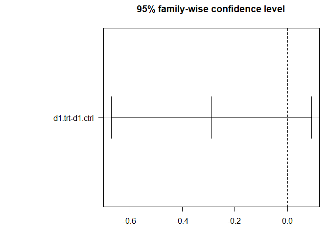

# Lab #7
Julian Stanley  
6 April 2018  


Introductory Matter
---------------

Ancova: numerical response, two explanatory: categorical and continuous


```r
x <- rnorm(100)
slopeA <- 2
interceptA <- 0
slopeB <- -1
interceptB <- 0

# Create a response variable as a function of treatment A
yA <- slopeA * x + interceptA + rnorm(100)

# Create a response variable as a function of treatment B
yB <- slopeB * x * interceptB + rnorm(100)

# Create a datafram with our yA and yB
myDat <- data.frame(y = c(yA, yB), x = c(x, x), trt = rep(c("A", "B"), 
                                                          each = length(x)))

str(myDat)
```

```
## 'data.frame':	200 obs. of  3 variables:
##  $ y  : num  0.571 4.191 4.224 2.603 2.719 ...
##  $ x  : num  0.412 1.864 1.933 1.487 1.513 ...
##  $ trt: Factor w/ 2 levels "A","B": 1 1 1 1 1 1 1 1 1 1 ...
```

```r
# Visualize data
plot(x, yA, col = "red")
points(x, yB, col = "blue")
abline(lm(yA ~ x), col = "red")
abline(lm(yB ~ x), col = "blue")
```

<!-- -->

```r
# Make a linear model object with interaction
mod <- lm(y ~ x * trt, data = myDat)

shapiro.test(mod$residuals)
```

```
## 
## 	Shapiro-Wilk normality test
## 
## data:  mod$residuals
## W = 0.99361, p-value = 0.5433
```

```r
qqnorm(mod$residuals)
qqline(mod$residuals, col = "red")
```

<!-- -->

```r
anova(mod)
```

```
## Analysis of Variance Table
## 
## Response: y
##            Df  Sum Sq Mean Sq  F value    Pr(>F)    
## x           1 202.505 202.505 197.2214 < 2.2e-16 ***
## trt         1   7.166   7.166   6.9788  0.008914 ** 
## x:trt       1 203.586 203.586 198.2745 < 2.2e-16 ***
## Residuals 196 201.251   1.027                       
## ---
## Signif. codes:  0 '***' 0.001 '**' 0.01 '*' 0.05 '.' 0.1 ' ' 1
```


### Challenge 1


```r
x <- rnorm(100)
slopeA <- 0
interceptA <- 0
slopeB <- 0
interceptB <- 0

# Create a response variable as a function of treatment A
yA <- slopeA * x + interceptA + rnorm(100)

# Create a response variable as a function of treatment B
yB <- slopeB * x * interceptB + rnorm(100)

# Create a datafram with our yA and yB
myDat <- data.frame(y = c(yA, yB), x = c(x, x), trt = rep(c("A", "B"), 
                                                          each = length(x)))

str(myDat)
```

```
## 'data.frame':	200 obs. of  3 variables:
##  $ y  : num  0.549 -0.804 1.665 -0.568 -0.203 ...
##  $ x  : num  -0.2433 -0.0801 0.5794 -0.2818 -0.2854 ...
##  $ trt: Factor w/ 2 levels "A","B": 1 1 1 1 1 1 1 1 1 1 ...
```

```r
# Visualize data
plot(x, yA, col = "red")
points(x, yB, col = "blue")
abline(lm(yA ~ x), col = "red")
abline(lm(yB ~ x), col = "blue")
```

<!-- -->

```r
# Make a linear model object with interaction
mod <- lm(y ~ x * trt, data = myDat)

shapiro.test(mod$residuals)
```

```
## 
## 	Shapiro-Wilk normality test
## 
## data:  mod$residuals
## W = 0.99503, p-value = 0.7539
```

```r
qqnorm(mod$residuals)
qqline(mod$residuals, col = "red")
```

<!-- -->

```r
anova(mod)
```

```
## Analysis of Variance Table
## 
## Response: y
##            Df  Sum Sq Mean Sq F value Pr(>F)
## x           1   1.055 1.05470  1.0403 0.3090
## trt         1   0.778 0.77783  0.7672 0.3822
## x:trt       1   2.121 2.12055  2.0915 0.1497
## Residuals 196 198.719 1.01387
```

### Challenge 2


```r
x <- rnorm(100)
slopeA <- 0
interceptA <- 0
slopeB <- 0
interceptB <- 2

# Create a response variable as a function of treatment A
yA <- slopeA * x + interceptA + rnorm(100)

# Create a response variable as a function of treatment B
yB <- slopeB * x * interceptB + rnorm(100)

# Create a datafram with our yA and yB
myDat <- data.frame(y = c(yA, yB), x = c(x, x), trt = rep(c("A", "B"), 
                                                          each = length(x)))

str(myDat)
```

```
## 'data.frame':	200 obs. of  3 variables:
##  $ y  : num  1.92 -0.856 -1.663 0.269 1.593 ...
##  $ x  : num  0.159 -1.821 0.618 -0.135 -0.745 ...
##  $ trt: Factor w/ 2 levels "A","B": 1 1 1 1 1 1 1 1 1 1 ...
```

```r
# Visualize data
plot(x, yA, col = "red")
points(x, yB, col = "blue")
abline(lm(yA ~ x), col = "red")
abline(lm(yB ~ x), col = "blue")
```

<!-- -->

```r
# Make a linear model object with interaction
mod <- lm(y ~ x * trt, data = myDat)

shapiro.test(mod$residuals)
```

```
## 
## 	Shapiro-Wilk normality test
## 
## data:  mod$residuals
## W = 0.99515, p-value = 0.7716
```

```r
qqnorm(mod$residuals)
qqline(mod$residuals, col = "red")
```

<!-- -->

```r
anova(mod)
```

```
## Analysis of Variance Table
## 
## Response: y
##            Df  Sum Sq Mean Sq F value Pr(>F)
## x           1   0.915 0.91484  0.9089 0.3416
## trt         1   0.260 0.25987  0.2582 0.6119
## x:trt       1   0.007 0.00716  0.0071 0.9329
## Residuals 196 197.273 1.00650
```

### Challenge 3


```r
x <- rnorm(100)
slopeA <- 2
interceptA <- 0
slopeB <- 2
interceptB <- 0


# Create a response variable as a function of treatment A
yA <- slopeA * x + interceptA + rnorm(100)

# Create a response variable as a function of treatment B
yB <- slopeB * x * interceptB + rnorm(100)

# Create a datafram with our yA and yB
myDat <- data.frame(y = c(yA, yB), x = c(x, x), trt = rep(c("A", "B"), 
                                                          each = length(x)))

str(myDat)
```

```
## 'data.frame':	200 obs. of  3 variables:
##  $ y  : num  -4.804 -1.81 -0.278 1.921 -1.62 ...
##  $ x  : num  -2.6525 -0.266 -0.0782 0.3821 -0.5749 ...
##  $ trt: Factor w/ 2 levels "A","B": 1 1 1 1 1 1 1 1 1 1 ...
```

```r
# Visualize data
plot(x, yA, col = "red")
points(x, yB, col = "blue")
abline(lm(yA ~ x), col = "red")
abline(lm(yB ~ x), col = "blue")
```

<!-- -->

```r
# Make a linear model object with interaction
mod <- lm(y ~ x * trt, data = myDat)

shapiro.test(mod$residuals)
```

```
## 
## 	Shapiro-Wilk normality test
## 
## data:  mod$residuals
## W = 0.99406, p-value = 0.6088
```

```r
qqnorm(mod$residuals)
qqline(mod$residuals, col = "red")
```

<!-- -->

```r
anova(mod)
```

```
## Analysis of Variance Table
## 
## Response: y
##            Df  Sum Sq Mean Sq  F value Pr(>F)    
## x           1 194.038 194.038 191.1371 <2e-16 ***
## trt         1   1.305   1.305   1.2858 0.2582    
## x:trt       1 206.281 206.281 203.1974 <2e-16 ***
## Residuals 196 198.975   1.015                    
## ---
## Signif. codes:  0 '***' 0.001 '**' 0.01 '*' 0.05 '.' 0.1 ' ' 1
```


### Challenge 4


```r
x <- rnorm(100)
slopeA <- 2
interceptA <- 4
slopeB <- 2
interceptB <- 0


# Create a response variable as a function of treatment A
yA <- slopeA * x + interceptA + rnorm(100)

# Create a response variable as a function of treatment B
yB <- slopeB * x * interceptB + rnorm(100)

# Create a datafram with our yA and yB
myDat <- data.frame(y = c(yA, yB), x = c(x, x), trt = rep(c("A", "B"), 
                                                          each = length(x)))

str(myDat)
```

```
## 'data.frame':	200 obs. of  3 variables:
##  $ y  : num  8.83 3.3 7.13 2.25 3.88 ...
##  $ x  : num  2.152 -0.806 1.641 -0.637 0.327 ...
##  $ trt: Factor w/ 2 levels "A","B": 1 1 1 1 1 1 1 1 1 1 ...
```

```r
# Visualize data
plot(x, yA, col = "red")
points(x, yB, col = "blue")
abline(lm(yA ~ x), col = "red")
abline(lm(yB ~ x), col = "blue")
```

<!-- -->

```r
# Make a linear model object with interaction
mod <- lm(y ~ x * trt, data = myDat)

shapiro.test(mod$residuals)
```

```
## 
## 	Shapiro-Wilk normality test
## 
## data:  mod$residuals
## W = 0.98997, p-value = 0.1769
```

```r
qqnorm(mod$residuals)
qqline(mod$residuals, col = "red")
```

<!-- -->

```r
anova(mod)
```

```
## Analysis of Variance Table
## 
## Response: y
##            Df  Sum Sq Mean Sq F value    Pr(>F)    
## x           1  257.94  257.94  314.20 < 2.2e-16 ***
## trt         1 1003.02 1003.02 1221.79 < 2.2e-16 ***
## x:trt       1  181.06  181.06  220.55 < 2.2e-16 ***
## Residuals 196  160.90    0.82                      
## ---
## Signif. codes:  0 '***' 0.001 '**' 0.01 '*' 0.05 '.' 0.1 ' ' 1
```

Main Assignment Task 1
----------------

### Part 1


```r
# Download data
d1 <- read.csv("http://faraway.neu.edu/data/lab6_dataset1.csv")

str(d1)
```

```
## 'data.frame':	80 obs. of  3 variables:
##  $ drug1: Factor w/ 2 levels "d1.ctrl","d1.trt": 1 1 1 1 1 1 1 1 1 1 ...
##  $ drug2: Factor w/ 2 levels "d2.ctrl","d2.trt": 1 1 1 1 1 1 1 1 1 1 ...
##  $ score: num  131 294 106 1206 340 ...
```

```r
head(d1)
```

```
##     drug1   drug2     score
## 1 d1.ctrl d2.ctrl  130.7839
## 2 d1.ctrl d2.ctrl  294.0187
## 3 d1.ctrl d2.ctrl  106.0989
## 4 d1.ctrl d2.ctrl 1206.2610
## 5 d1.ctrl d2.ctrl  340.1912
## 6 d1.ctrl d2.ctrl  107.7196
```
Data has two categorical treatments: d2 treatment or d1 treatment, and one numerical response variable: score

### Part 2


```r
# Visualize distribution
par(mfrow = c(2,2))
hist(d1$score, main = "Raw Data")
hist(log(d1$score), main = "Log Transformed Data")

qqnorm(d1$score, main = "QQ Raw Data")
qqline(d1$score)
qqnorm(log(d1$score), main = "QQ Log Transformed")
qqline(log(d1$score))
```

<!-- -->

```r
shapiro.test(d1$score)
```

```
## 
## 	Shapiro-Wilk normality test
## 
## data:  d1$score
## W = 0.73545, p-value = 1.06e-10
```

```r
shapiro.test(log(d1$score))
```

```
## 
## 	Shapiro-Wilk normality test
## 
## data:  log(d1$score)
## W = 0.98498, p-value = 0.4735
```
Data is greatly improved by a log transformation of the numerical response variable.

### Part 3


```r
interactionModel <- aov(log(d1$score) ~ drug1 * drug2, data = d1)
summary(interactionModel)
```

```
##             Df Sum Sq Mean Sq F value   Pr(>F)    
## drug1        1   1.67    1.67   2.283    0.135    
## drug2        1  64.77   64.77  88.344 2.30e-14 ***
## drug1:drug2  1  19.69   19.69  26.861 1.75e-06 ***
## Residuals   76  55.72    0.73                     
## ---
## Signif. codes:  0 '***' 0.001 '**' 0.01 '*' 0.05 '.' 0.1 ' ' 1
```

### Part 4

We conclude that the interaction is significant (p < 0.01).

### Part 5


```r
tukeyModel <- TukeyHSD(interactionModel)
par(mar = c(3,11,3,1))
plot(TukeyHSD(interactionModel), las = 1)
```

<!-- --><!-- --><!-- -->


### Part 6

There is a significant difference between the treatment and control of drug 2

### Part 7

```r
se <- function(x) sqrt(var(x)/length(x))

print("Means:")
```

```
## [1] "Means:"
```

```r
(means <- tapply(d1$score, list(d1$drug1, d1$drug2), FUN = mean))
```

```
##          d2.ctrl    d2.trt
## d1.ctrl 409.8340 148.64364
## d1.trt  807.3275  66.86432
```

```r
print("Standard Errors:")
```

```
## [1] "Standard Errors:"
```

```r
(ses <- tapply(d1$score, list(d1$drug1, d1$drug2), FUN = se))
```

```
##           d2.ctrl   d2.trt
## d1.ctrl  71.49569 18.21108
## d1.trt  133.05086 21.24376
```

```r
require(multcompView)
```

```
## Loading required package: multcompView
```

```
## Warning: package 'multcompView' was built under R version 3.4.4
```

```r
(labels <- multcompLetters(tukeyModel$`drug1:drug2`[, "p adj"])$Letters)
```

```
##  d1.trt:d2.ctrl  d1.ctrl:d2.trt   d1.trt:d2.trt d1.ctrl:d2.ctrl 
##             "a"             "b"             "c"             "a"
```

```r
labels <- labels[c("d1.ctrl:d2.ctrl", "d1.trt:d2.ctrl", "d1.ctrl:d2.trt", "d1.trt:d2.trt")]

bar <- barplot(means, beside = TRUE, legend.text = c("D1 Control", "D1 Treatment"), names = c("D2 Control", "D2 Treatment"), ylab = "Score", col = c("aquamarine3", "coral3"), ylim = c(0, 1200))

arrows(x0 = bar, y0 = c(means[1] - 2*ses[1], means[2] - 2*ses[2], means[3] - 2*ses[3], means[4] - 2*ses[4]) , x1 = bar, y1 = c(means[1] + 2*ses[1], means[2] + 2*ses[2], means[3] + 2*ses[3], means[4] + 2*ses[4]), angle = 90, code = 3)

text(x = bar, y = c(means[1] + 2*ses[1], means[2] + 2*ses[2], means[3] + 2*ses[3], means[4] + 2*ses[4]), labels, pos = 3)
```

<!-- -->

### Part 8


```r
interaction.plot(d1$drug1, d1$drug2, response = d1$score)
```

<!-- -->


### Part 9

The cocktail of both drug1 and drug2 is more effective than either drug by itself

Task 2
----------------


```r
d2 <- read.csv("http://faraway.neu.edu/data/lab6_dataset2.csv")

str(d2)
```

```
## 'data.frame':	160 obs. of  4 variables:
##  $ drug1: Factor w/ 2 levels "d1.ctrl","d1.trt": 1 1 1 1 1 1 1 1 1 1 ...
##  $ drug2: Factor w/ 2 levels "d2.ctrl","d2.trt": 1 1 1 1 1 1 1 1 1 1 ...
##  $ score: num  99.8 294.4 1197.3 79 225.8 ...
##  $ sex  : Factor w/ 2 levels "female","male": 2 2 2 2 2 2 2 2 2 2 ...
```

```r
head(d2)
```

```
##     drug1   drug2      score  sex
## 1 d1.ctrl d2.ctrl   99.79174 male
## 2 d1.ctrl d2.ctrl  294.37345 male
## 3 d1.ctrl d2.ctrl 1197.32518 male
## 4 d1.ctrl d2.ctrl   79.01394 male
## 5 d1.ctrl d2.ctrl  225.82226 male
## 6 d1.ctrl d2.ctrl  279.33738 male
```

### Part 1


```r
hist(log(d2$score))
```

<!-- -->

```r
model2 <- aov(log(d2$score) ~ drug1 + drug2 + sex + drug1*drug2 + drug2*sex + drug1*drug2*sex, data = d2)
summary(model2)
```

```
##                  Df Sum Sq Mean Sq F value   Pr(>F)    
## drug1             1   1.03    1.03   1.049  0.30741    
## drug2             1  84.46   84.46  86.086  < 2e-16 ***
## sex               1   8.41    8.41   8.576  0.00393 ** 
## drug1:drug2       1   5.51    5.51   5.613  0.01909 *  
## drug2:sex         1  10.08   10.08  10.278  0.00164 ** 
## drug1:sex         1   2.54    2.54   2.593  0.10938    
## drug1:drug2:sex   1  22.25   22.25  22.679 4.43e-06 ***
## Residuals       152 149.12    0.98                     
## ---
## Signif. codes:  0 '***' 0.001 '**' 0.01 '*' 0.05 '.' 0.1 ' ' 1
```
Data is log-normal. Drug 1 has no effect, there is no interaction between drug 1 and sex. There is an effect of drug 2 and of sex, and an interaction between drug2 and sex, drug1 and drug2, and all three variables.

### Part 2


```r
par(mfrow = c(2,1))
interaction.plot(d2$drug1, d2$sex, response = d2$score)
interaction.plot(d2$drug2, d2$sex, response = d2$score)
```

<!-- -->

### Part 3

Female and drug 1 treatment are antagonistic, female and drug 1 are synergistic.

### Part 4


```r
d2mean <- aggregate(score ~ drug1 + drug2 + sex, FUN = mean, data = d2)
d2se <- aggregate(score ~ drug1 + drug2 + sex, FUN = se, data = d2)

tukeyModel2 <- TukeyHSD(model2)

bar2 <- barplot(cbind(d2mean[1:4,4], cbind(d2mean[5:8, 4])), beside = TRUE, legend.text = c("Drug 1 Control + Drug 2 Control", "Drug 1 Treatment + Drug 2 Control", "Drug 1 Control + Drug 2 Treatment", "Drug 1 Treatment + Drug 2 Treatment"), args.legend = list(x = "topleft"), names = c("Female", "Male"), ylim = c(0, 2000))

arrows(x0 = bar2, y0 = d2mean$score - 2*d2se$score , x1 = bar2, y1 = d2mean$score + 2*d2se$score, angle = 90, code = 3)

require(multcompView)
(labels <- multcompLetters(tukeyModel2$`drug1:drug2:sex`[, "p adj"])$Letters)
```

```
##  d1.trt:d2.ctrl:female  d1.ctrl:d2.trt:female   d1.trt:d2.trt:female 
##                   "ab"                   "cd"                   "ac" 
##   d1.ctrl:d2.ctrl:male    d1.trt:d2.ctrl:male    d1.ctrl:d2.trt:male 
##                   "be"                    "e"                  "abc" 
##     d1.trt:d2.trt:male d1.ctrl:d2.ctrl:female 
##                    "d"                   "ab"
```

```r
labels <- labels[c("d1.ctrl:d2.ctrl:female", "d1.trt:d2.ctrl:female", "d1.ctrl:d2.trt:female", "d1.trt:d2.trt:female", "d1.ctrl:d2.ctrl:male", "d1.trt:d2.ctrl:male", "d1.ctrl:d2.trt:male", "d1.trt:d2.trt:male")]
text(x = bar2, y = d2mean$score + 2*d2se$score, labels, pos = 3)
```

<!-- -->

### Task 5

There is no significant difference between treatment and no treatment in females.

In males, a combination therapy is the most effective treatment. 

